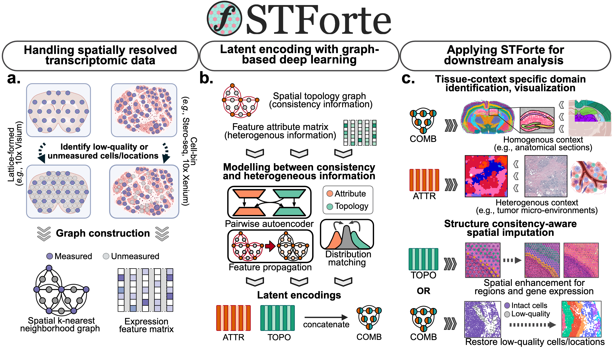

# STForte: tissue context-specific encoding and consistency-aware spatial imputation for spatially resolved transcriptomics

🔭 [Overview](#overview) | 🔧 [Installation](#installation) | 🔬 [Tutorials](#tutorials) | 📖 [Citation](#citation)


## Overview

STForte is a pairwise graph autoencoding-based approach for SRT data analysis, which is capable of matching the information between expression profiles and spatial topology in the latent space. STForte benefits from the designed framework to provide encodings with justifiable spatial correlations for the downstream analysis of both homogeneous and heterogeneous SRT data. Moreover, STForte can unravel the biological patterns of unobserved locations or recover deficient measurements to enable spatial enhancement.

## Installation

* **System requirements**:
  * Machine with at least 16 GB of RAM.
  * A GPU with at least 8GB RAM ($\geq$ 16GB is recommended) to reproduce experiments in this study.
* **Software requirments**
  * **Basic requirements**: Theoretically, any compatible versions of the following packages could be used to set up working environment for STForte.
    * STForte requires Python with core libraries include Pytorch, Pytorch-geometric, Pytorch-lightning and Scanpy to achieve basic functions.
    * STForte clustering helpers requires rpy2 with mclust installed in R
    * STGraph module may require scvi-tools if you want to use scVI for preprocessing
  * Additional noticements:
    * Due to some basic gramma changes in the new version of scipy and pytorch-lightning, we suggest `scipy<=1.11.4` and `pytorch-lightning<=1.9.5`.
    * Installing the newest version of scanpy may raise conflicts caused by H5py, please degrade the version of H5py.  
    * The .yaml conda env files are generated using conda of version 24.5.0. We suggest to align your conda version with us before directly build up env from `.yaml`.
  * Example competible combination (Linux-64 + Python 3.11 + Pytorch 2.2.2 + CUDA 12.1)

    ```
        python==3.11.8
        pytorch==2.2.2
        pytorch-cuda==12.1
        pytorch-lightning==1.9.5
        torch-geometric==2.5.3
        torch-scatter==2.1.2+pt22cu121
        torch-sparse==0.6.18+pt22cu121
        torch-cluster==1.6.3+pt22cu121
        scanpy==1.10.2
        scipy==1.11.4
        rpy2==3.5.11
        R-base==4.2.3
        mclust==6.1.1
        ipykernel==6.29.5
        ipywidgets==8.1.3
    ```

  * Example competible combination (Linux-64 + Python 3.9 + Pytorch 1.12.1 + CUDA 11.3)

    ```
    python==3.9.16
    pytorch==1.12.1
    cuda-toolkit==11.3
    pytorch-lightning==1.9.4
    torch-geometric==2.2.0
    torch-scatter==2.1.0
    torch-sparse==0.6.16
    torch-cluster==1.6.3
    scanpy==1.9.2
    scipy==1.11.4
    rpy2==3.5.11
    R-base==4.2.3
    mclust==6.0.1
    ipykernel==6.29.5
    ipywidgets==8.1.3
    ```

## Tutorials

### Notebooks from the original experiments

You can find the tutorials derived from the original experiments in the [`tutorials`](./tutorials) directory.

### Colab Notebooks

You can learn how to use STForte by following the Colab tutorial provided in our [APBJC 2024 tutorial](https://sites.google.com/view/apbjc2024-workshop-st-analysis):

| Notebook | Link |
|----------|------|
| 🔬 Spatial domain identification and spatial enhancement on 10x Visium FFPE Mouse Kidney dataset | [](https://colab.research.google.com/drive/17PC4YX2M0Xt2BKvBrlyBENdHmtZgCPpL?usp=sharing) |
| 🔬 Spatial domain identification and cell-cell communication on 10x Visium Human Breast Cancer Dataset using STForte $\times$ [COMMOT](https://commot.readthedocs.io/en/latest/) | [](https://colab.research.google.com/github/你的用户名/你的仓库/blob/main/eval.ipynb) |
|🔬 Multi-slice spatial transcriptomics alignment Using [PASTE2](https://github.com/raphael-group/paste2) $\times$ STForte|[](https://colab.research.google.com/drive/10a6Atxmq6NAXtrK8s4k1xoaIf_FOkXLc?usp=sharing)|

## Experiment Codes/Notebooks

The original experiment codes and Jupyter notebooks used in this work are stored [here](https://github.com/poncey/STForte_Experiments).

## Citation 

```
@article{10.1093/bib/bbaf174,
    author = {Pang, Yuxuan and Wang, Chunxuan and Zhang, Yao-zhong and Wang, Zhuo and Imoto, Seiya and Lee, Tzong-Yi},
    title = {STForte: tissue context-specific encoding and consistency-aware spatial imputation for spatially resolved transcriptomics},
    journal = {Briefings in Bioinformatics},
    volume = {26},
    number = {2},
    pages = {bbaf174},
    year = {2025},
    month = {04},
    issn = {1477-4054},
    doi = {10.1093/bib/bbaf174},
    url = {https://doi.org/10.1093/bib/bbaf174},
}
```

