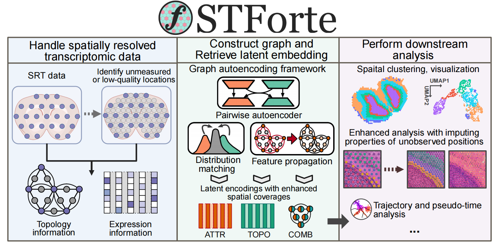

# STForte: enhanced spatially resolved transcriptomics analysis by matching between expression profiles and spatial topology



## Overview

STForte is a pairwise graph autoencoding-based approach for SRT data analysis, which is capable of matching the information between expression profiles and spatial topology in the latent space. STForte benefits from the designed framework to provide encodings with justifiable spatial correlations for the downstream analysis of both homogeneous and heterogeneous SRT data. Moreover, STForte can unravel the biological patterns of unobserved locations or recover deficient measurements to enable spatial enhancement.

## Installation

* **System requirements**:
  * Machine with at least 16 GB of RAM.
  * A GPU with at least 8GB RAM ($\geq$ 16GB is recommended) to reproduce experiments in this study.
* **Software requirments**
  * **Basic requirements**: Theoretically, any compatible versions of the following packages could be used to set up working environment for STForte.
    * STForte requires Python with core libraries include Pytorch, Pytorch-geometric, Pytorch-lightning and Scanpy to achieve basic functions.
    * STForte clustering helpers requires rpy2 with mclust installed in R
    * STGraph module may require scvi-tools if you want to use scVI for preprocessing
  * Additional noticements:
    * Due to some basic gramma changes in the new version of scipy and pytorch-lightning, we suggest `scipy<=1.11.4` and `pytorch-lightning<=1.9.5`.
    * Installing the newest version of scanpy may raise conflicts caused by H5py, please degrade the version of H5py.  
    * The .yaml conda env files are generated using conda of version 24.5.0. We suggest to align your conda version with us before directly build up env from `.yaml`.
  * Example competible combination (Linux-64 + Python 3.11 + Pytorch 2.2.2 + CUDA 12.1)

    ```
        python==3.11.8
        pytorch==2.2.2
        pytorch-cuda==12.1
        pytorch-lightning==1.9.5
        torch-geometric==2.5.3
        torch-scatter==2.1.2+pt22cu121
        torch-sparse==0.6.18+pt22cu121
        torch-cluster==1.6.3+pt22cu121
        scanpy==1.10.2
        scipy==1.11.4
        rpy2==3.5.11
        R-base==4.2.3
        mclust==6.1.1
        ipykernel==6.29.5
        ipywidgets==8.1.3
    ```

  * Example competible combination (Linux-64 + Python 3.9 + Pytorch 1.12.1 + CUDA 11.3)

    ```
    python==3.9.16
    pytorch==1.12.1
    cuda-toolkit==11.3
    pytorch-lightning==1.9.4
    torch-geometric==2.2.0
    torch-scatter==2.1.0
    torch-sparse==0.6.16
    torch-cluster==1.6.3
    scanpy==1.9.2
    scipy==1.11.4
    rpy2==3.5.11
    R-base==4.2.3
    mclust==6.0.1
    ipykernel==6.29.5
    ipywidgets==8.1.3
    ```

## Tutorials

You can find the STForte tutorials in the `tutorials` directory.

## Experiment Codes/Notebooks

The original experiment codes and Jupyter notebooks used in this work are stored [here](https://github.com/poncey/STForte_Experiments).

## Citation 

Currently, you can cite STForte through bioRxiv (DOI: [https://doi.org/10.1101/2024.08.16.608230](https://doi.org/10.1101/2024.08.16.608230)).

```
@article {2024.08.16.608230,
	author = {Pang, Yuxuan and Wang, Chunxuan and Zhang, Yao-zhong and Wang, Zhuo and Imoto, Seiya and Lee, Tzong-Yi},
	title = {Enhanced spatially resolved transcriptomics analysis by matching between expression profiles and spatial topology},
	elocation-id = {2024.08.16.608230},
	year = {2024},
	doi = {10.1101/2024.08.16.608230},
	publisher = {Cold Spring Harbor Laboratory},
	URL = {https://www.biorxiv.org/content/early/2024/08/19/2024.08.16.608230},
	eprint = {https://www.biorxiv.org/content/early/2024/08/19/2024.08.16.608230.full.pdf},
	journal = {bioRxiv}
}
```

